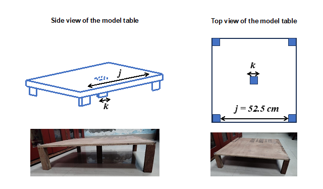
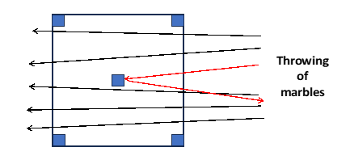
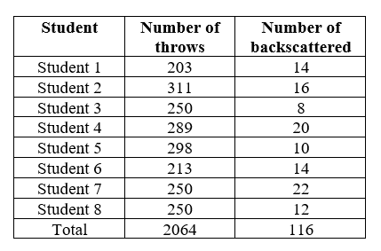
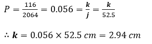

<b>Procedure in Simulation :</b> 
1. Click Add Table to place the gold foil. 
2. Then click Add Particles (Alpha Particles). 
3. Select a trial (1–8) or press C for custom trials. 
4. For custom trial, enter particles and click Calculate. 
5. Click Set Speed to randomize particle speed. 
6. Finally click Start Simulation. 
7. Blue dots go straight. 
8. Red dots are scattered. 
9. Press Reset to reset anytime.  

<b>Procedure in laboratory :</b> 
<b>Apparatus :</b> 
•	Glass marbles 
•	A table with four legs at four corner and one at the center. 

<b>Procedure in laboratory (diagram) :</b> 
 

<b>Procedure in laboratory :</b> 

1.	A model of an atom is made with a table with a leg at the center. The complete table from one side is considered to be the cross section of an atom and the central leg is considered to be the cross section of the nucleus inside the atom. Note that in Rutherford’s experiment, the situation was a 2D problem, which has been brought down to a 1D problem in the present experiment.  

2.	Glass marbles are thrown unbiasedly by several students towards the table. A total 2064 experiments have been performed. In most of the cases, the marbles pass through the table, however, for some instances, one will see the back scattering of marbles. 

 

3.	The ratio of number of marbles backscattered with respect to the total number of marbles thrown is calculated.  

4.	With the help of the equation 1, the length of the central leg (k) is calculated. 

<b>Data :</b> 
 

<b>Analysis :</b> 
The total number of backscattered events = 116 
The total number of marbles thrown = 2064 
The probability of backscattering, P=116/2064=0.056≡ probability of hitting of an alpha particle to a nucleus in Rutherford’s experiment.  
The side length, j = 52.5 cm  
Length of the central leg = k cm  
According to the equation 1  

 

The measured length of the central leg is 3 cm. 
Thus, the estimated length of the central leg found to be very close to the actual length.  
This way, Rutherford estimated the size of the nucleus of gold-atom from the α-particle backscattering experiment.  
