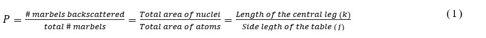

Rutherford's gold foil experiment showed that the atom is mostly empty space with a tiny, dense, positively-charged nucleus. Based on these results, Rutherford proposed the nuclear model of the atom. 

Ernest Rutherford got the idea that the structure of atoms could be probed by observing the scattering of alpha particles. Alpha particles, as Rutherford himself had demonstrated, are the positively charged discharges of radioactive substances. They are the bare helium nuclei. According to the raisin pudding model, an alpha particle traversing a thin gold film should experience many small angle deflections as it passes close to or through the positive spheres of the gold atoms. This prediction turned out to be correct for very small angles of scattering. But in experiments initiated at Rutherford’s direction, Geiger and Marsden (1909) found that 1 in 8000 alpha particles passing through a thin film of gold was scattered through more than 90◦. It was as though bullets fired at a bale of cotton could occasionally ricochet backward. Such an observation might lead one to suspect rocks in the cotton. 

At this point Rutherford (1911) advanced the hypothesis that the positive charge and most of the mass of an atom is concentrated in a “nucleus” with dimensions of the order of 10−12 cm (10,000 times smaller than the atom as a whole) with the electrons in some sort of configuration around it. 

In this experiment, we will model Rutherford’s experiment with glass marvels and will estimate the size of the nucleus (leg of the model table). 
<!-- A model of gold atom will be prepared as shown in Fig. 1.--> 
As in the case of gold, most of the parts are occupied by electron (free space in the model). Several (~2000) marvels will be thrown to the model and the number of back scattered ball will be counted. From this the probability of backscattering will be calculated as, 

 

For this experiment the probability of backscattering will be measured and from equation (1) the area, thus the length of the leg of the table will be estimated.
